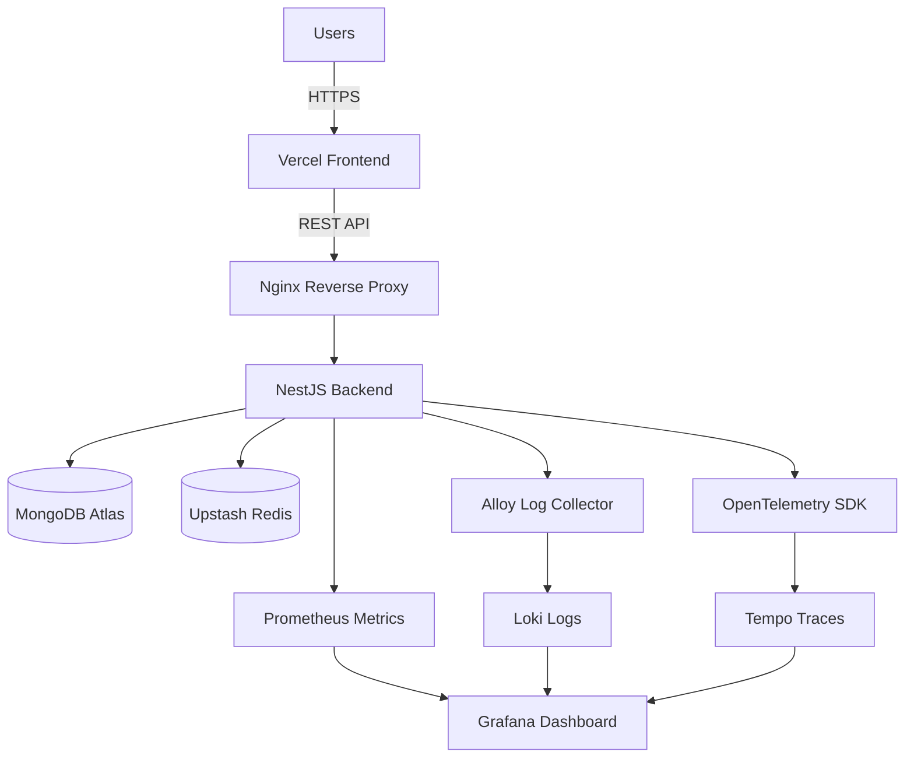
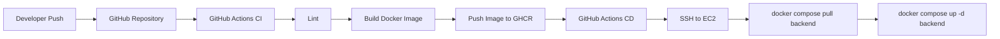

# JobSeeker

A production-ready full-stack job portal platform built with modern web technologies, cloud infrastructure, observability tooling, and automated CI/CD pipelines.

## Features

### Job Seeker Features

- User registration and authentication
- Email verification and password reset
- Browse and search jobs
- Save jobs for later
- Apply to jobs with resume upload
- Personalized job recommendations
- Application tracking

### Employer Features

- Create and manage job postings
- View applicants
- Applicant analytics dashboard
- Candidate management

### Platform Features

- JWT authentication with refresh token rotation
- Redis caching
- OpenTelemetry tracing
- Centralized logging
- Metrics collection
- HTTPS with Let's Encrypt
- Automated CI/CD deployments

---

## Tech Stack

### Frontend

- React
- Vite
- Tailwind CSS v4
- Redux Toolkit
- RTK Query

### Backend

- NestJS
- MongoDB Atlas
- Mongoose
- Redis (Upstash)

### Infrastructure

- Docker
- Docker Compose
- AWS EC2
- Terraform
- Ansible
- Nginx
- Certbot

### Observability

- Prometheus
- Grafana
- Loki
- Tempo
- Alloy
- OpenTelemetry

### DevOps

- GitHub Actions
- GitHub Container Registry

---

## Architecture



Additional documentation:

- `docs/architecture.md`
- `docs/deployment.md`
- `docs/monitoring.md`
- `docs/ci-cd.md`

---

## CI/CD Pipeline



---

## Monitoring Stack

The platform includes full observability support.

### Metrics

- HTTP request count
- HTTP request duration
- CPU usage
- Memory usage
- Event loop lag
- Container metrics

### Logs

```
Backend -> Alloy -> Loki -> Grafana
```

### Traces

```
Backend -> OpenTelemetry -> Tempo -> Grafana
```

---

## Deployment

Infrastructure provisioning:

```bash
terraform init
terraform apply
```

Configuration management:

```bash
ansible-playbook playbook.yml
```

Application deployment:

```bash
git push origin main
```

Deployment is performed automatically using GitHub Actions.

---

## Local Development

```bash
git clone <repository>
cd backend

npm install

cp .env.example .env

docker compose up -d

npm run start:dev
```

---

## Project Structure

```text
backend/
frontend/
infra/
monitoring/
docs/
```

---

## Screenshots

### Homepage

<!-- Add screenshot -->

### Employer Dashboard

<!-- Add screenshot -->

### Grafana Dashboard

<!-- Add screenshot -->

---

## Documentation

- `docs/architecture.md`
- `docs/deployment.md`
- `docs/monitoring.md`
- `docs/ci-cd.md`
- `docs/local-development.md`

---

## Future Improvements

- WebSocket notifications
- Resume analyzer
- AI-powered recommendations
- Kubernetes deployment
- Blue-Green deployments
- Horizontal scaling

---

## License

MIT License