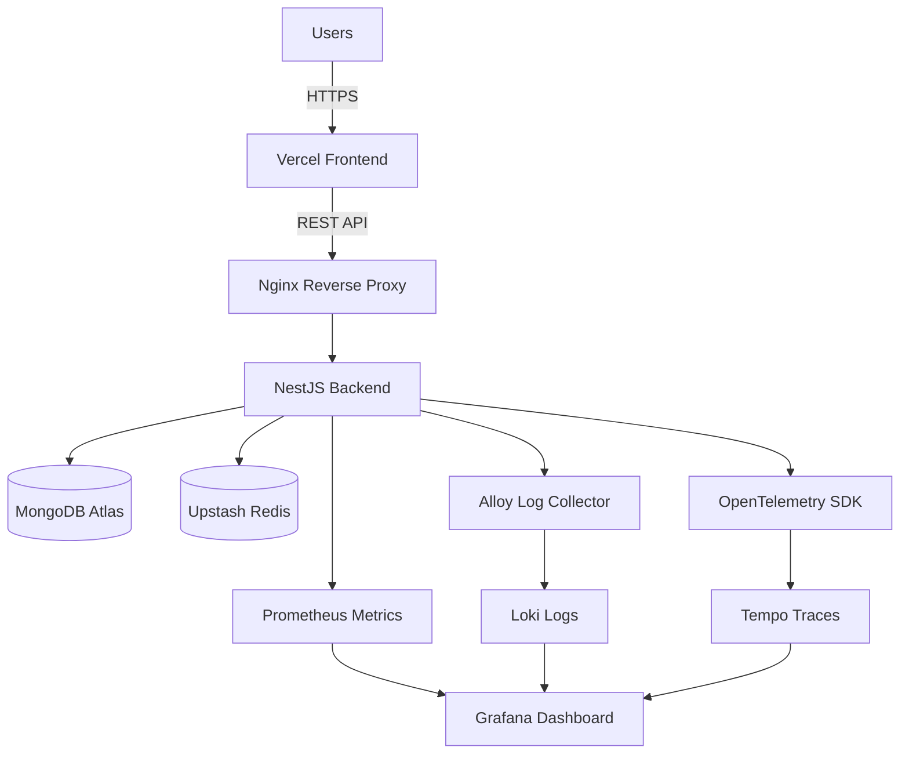
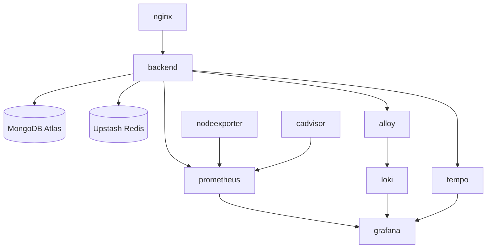
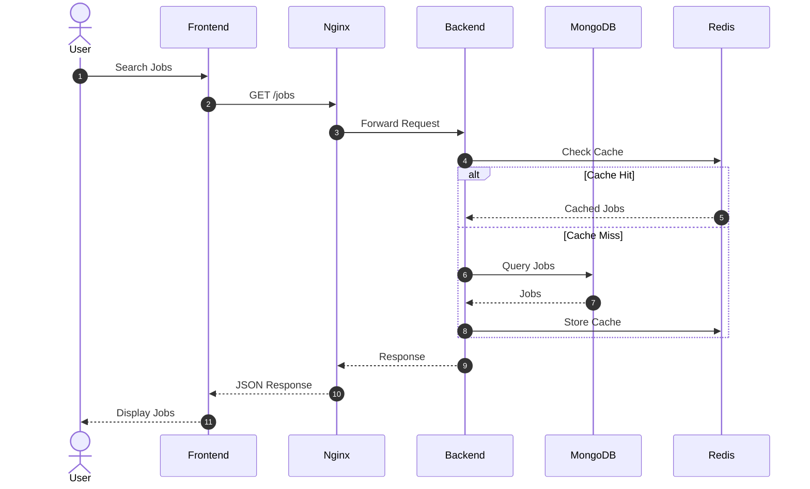

# Architecture

## Overview

JobSeeker is a full-stack job portal platform built with React, NestJS, MongoDB Atlas, Redis, Docker, and AWS.

The platform consists of:

- React + Vite frontend
- NestJS backend API
- MongoDB Atlas database
- Upstash Redis cache
- Nginx reverse proxy
- Prometheus metrics collection
- Grafana dashboards
- Loki centralized logging
- Tempo distributed tracing
- GitHub Actions CI/CD
- AWS EC2 deployment infrastructure

## High-Level Architecture

## Container Architecture

## Request Flow

