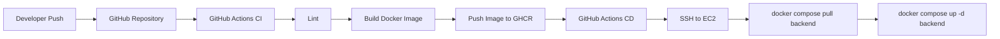

# CI/CD Pipeline

The application uses GitHub Actions for Continuous Integration and Continuous Deployment.

## CI Stage

- Checkout repository
- Install dependencies
- Run linting
- Build Docker image
- Push image to GHCR

## CD Stage

- SSH into EC2
- Pull latest image
- Restart backend container

## CI/CD Flow

