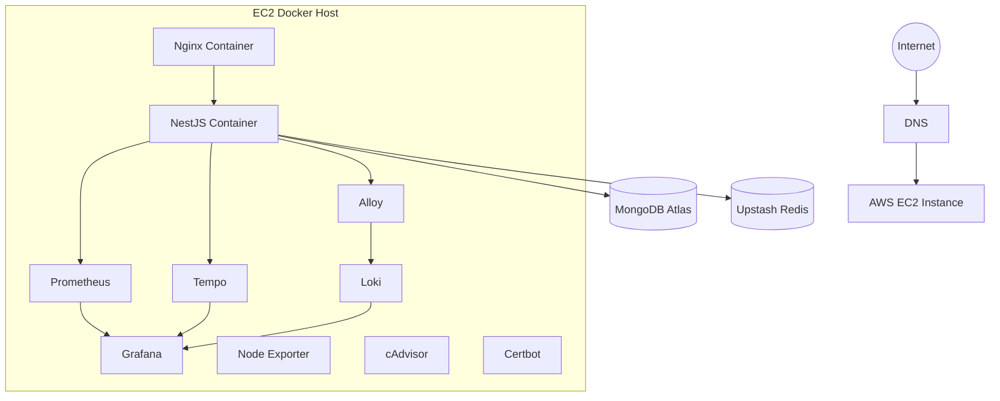

# Deployment

## Infrastructure

Infrastructure provisioning is performed using:

- Terraform
- AWS VPC
- Security Groups
- EC2 Instance

Configuration management is handled using:

- Ansible

Deployment is performed using:

- Docker Compose
- GitHub Actions
- GitHub Container Registry

## Deployment Architecture

