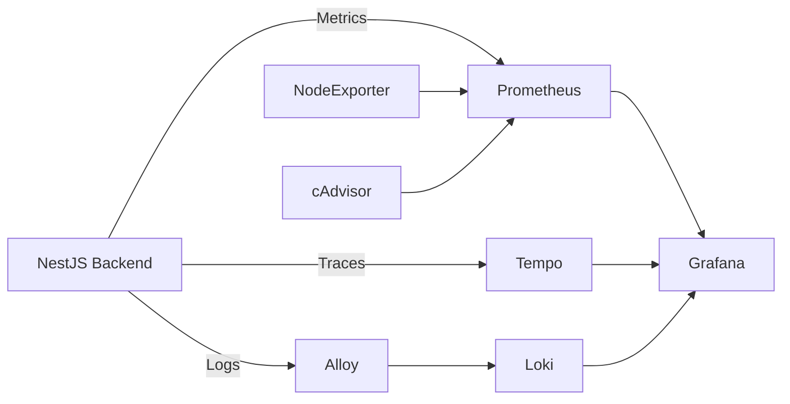

# Monitoring and Observability

The JobSeeker platform uses a complete observability stack.

## Components

- Prometheus
- Grafana
- Loki
- Alloy
- Tempo
- OpenTelemetry
- Node Exporter
- cAdvisor

## Observability Architecture



## Metrics

Collected using:

- Prometheus
- Node Exporter
- cAdvisor
- Custom NestJS metrics

## Logs

Flow:

```text
Backend -> Alloy -> Loki -> Grafana
```

## Traces

Flow:

```text
Backend -> OpenTelemetry -> Tempo -> Grafana
```